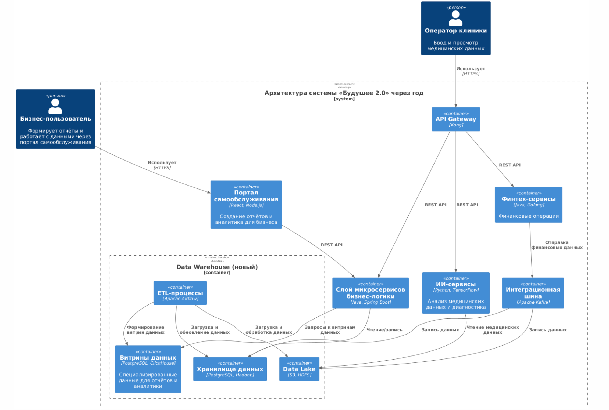

## 1.1. Спроектируйте архитектуру системы через год. Составьте диаграмму контейнеров в модели C4.

## Обоснование архитектуры системы «Будущее 2.0»

### Цели архитектуры
Проектируемая архитектура решает ключевые задачи бизнеса:

- Создание удобной и масштабируемой витрины данных для бизнес-пользователей.
- Упрощение интеграции новых направлений бизнеса (финтех, ИИ, медицина).
- Уменьшение нагрузки на устаревший DWH и переход на современные инструменты работы с большими данными.

### Картинка архитектуры представлена ниже

### Почему выбрана такая архитектура?

#### 1. Портал самообслуживания (React, Node.js)
- Лёгкость разработки и поддержки.
- Гибкость интерфейса, возможность кастомизации отчетов и аналитики.
- Высокая производительность и удобство использования для бизнес-пользователей.

#### 2. Data Warehouse и Data Lake (PostgreSQL, Hadoop, S3, HDFS)
- Data Lake позволяет эффективно хранить большие объёмы неструктурированных и полуструктурированных данных (финансовые транзакции, данные медицинских исследований).
- Новый DWH на PostgreSQL обеспечивает структурированное хранение данных и быстрые запросы для аналитики.
- Использование Hadoop и S3 даёт возможность масштабирования системы по мере роста бизнеса.

#### 3. ETL-процессы (Apache Airflow)
- Автоматизация и прозрачное управление процессами загрузки и трансформации данных.
- Возможность легко менять логику обработки без значительного переписывания системы.

#### 4. Микросервисная архитектура (Java, Spring Boot)
- Удобство и скорость интеграции новых бизнес-направлений без существенных изменений существующей логики.
- Автономность компонентов, улучшение отказоустойчивости и масштабируемости.

#### 5. API Gateway (Kong)
- Централизованное управление API, удобство интеграции.
- Возможность контроля доступа и обеспечение безопасности.

#### 6. Интеграционная шина (Apache Kafka)
- Реализация асинхронной и надежной передачи сообщений между сервисами.
- Возможность обработки большого потока данных, что важно для растущих направлений бизнеса.

#### 7. ИИ-сервисы (Python, TensorFlow)
- Эффективная интеграция и обработка медицинских данных с использованием машинного обучения.
- Возможность масштабирования аналитических процессов для диагностики и прогнозирования.

#### 8. Финтех-сервисы (Java, Golang)
- Надёжность и высокая производительность для финансовых транзакций.
- Гибкость при интеграции с банковскими и платёжными системами.

### Итог
Выбранная архитектура соответствует поставленным бизнес-целям, обеспечивает масштабируемость и гибкость в работе с данными, а также позволяет эффективно интегрировать и развивать новые направления бизнеса.

## 1.2 + 1.3. Опишите проблемные места. Сделайте это в удобной для вас форме. Например, можете использовать список или таблицу. Постарайтесь формулировать описания так, чтобы они были понятны не только инженерам, но и бизнесу. + приоритеты

## Проблемные места в текущей архитектуре

### 1. Устаревший DWH (SQL Server 2008)

**Описание:**
- Старый SQL Server имеет ограничения по производительности.
- Хранение всех данных в одной базе замедляет построение отчётов.
- Сложность в масштабировании и интеграции новых бизнесов.

**Приоритет:** Высокий (Must-have)

---

### 2. Ограниченная BI-система

**Описание:**
- Power BI медленно обрабатывает запросы к огромному количеству данных.
- Невозможность оперативного построения отчётов из-за сложных трансформаций.

**Приоритет:** Высокий (Must-have)

---

### 3. Разрозненные домены данных

**Описание:**
- Разные направления бизнеса (медицина, финтех, ИИ) работают независимо, но используют общий DWH.
- Сложно обеспечить независимость доменов при сохранении общей архитектуры.

**Приоритет:** Средний (Should-have)

---

### 4. Отсутствие витрины данных

**Описание:**
- Нет удобного самообслуживания для бизнес-пользователей.
- Отчёты строятся вручную, что требует значительных затрат времени.

**Приоритет:** Высокий (Must-have)

---

### 5. Отсутствие полноценной интеграционной платформы

**Описание:**
- Существующая интеграция на Apache Camel не справляется с большими потоками данных.
- Не поддерживает полноценный асинхронный обмен.

**Приоритет:** Высокий (Must-have)

---

### 6. Сложная и запутанная бизнес-логика в DWH

**Описание:**
- Бизнес-логика и интерфейс тесно связаны, что затрудняет модификацию.
- Значительные усилия на поддержку системы при каждом изменении бизнес-процессов.

**Приоритет:** Высокий (Must-have)

---

### 7. Совместное хранение медицинских и финансовых данных

**Описание:**
- Нет чёткого разделения между медицинскими и финансовыми данными.
- Высокий риск несоответствия регуляторным требованиям по защите персональных данных.

**Приоритет:** Высокий (Must-have)

---

### 8. Отсутствие единой точки доступа к данным (портал)

**Описание:**
- Пользователям сложно получить единую картину данных, так как информация распределена по разным системам.
- Анализ данных требует дополнительных затрат времени.

**Приоритет:** Высокий (Must-have)

---

## Итоговая приоритизация проблем

| Проблема                                          | Приоритет   |
|---------------------------------------------------|-------------|
| Устаревший DWH (SQL Server 2008)                  | Must-have   |
| Ограниченная BI-система                           | Must-have   |
| Отсутствие витрины данных                         | Must-have   |
| Отсутствие полноценной интеграционной платформы   | Must-have   |
| Сложная и запутанная бизнес-логика в DWH          | Must-have   |
| Совместное хранение медицинских и финансовых данных| Must-have  |
| Отсутствие единой точки доступа к данным (портал) | Must-have   |
| Разрозненные домены данных                        | Should-have |