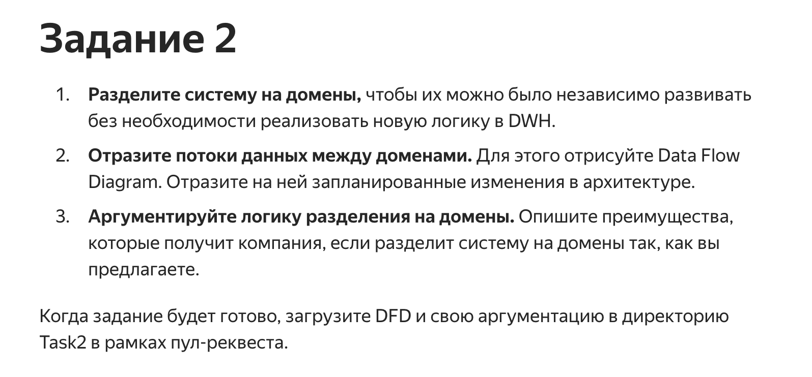
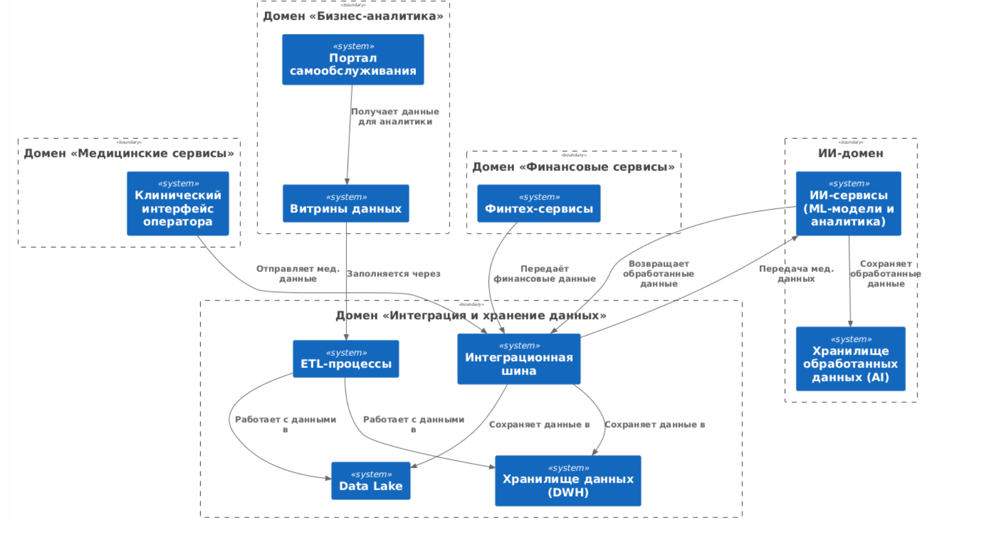
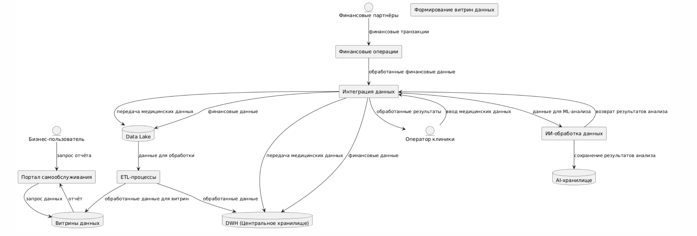
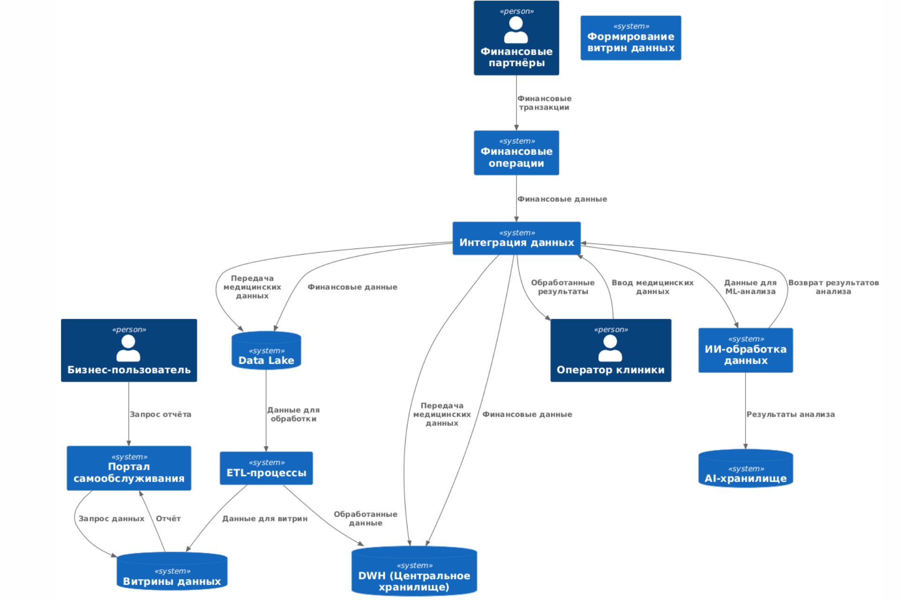

## 1.1-1.2. Разделение на домены

## 1.1 - 1.2. Более подробные DFD диаграммы

и с использованием <C4/C4_Context> то же самое

## 1.3. Аргументация - обновлённая логика разделения системы на домены и преимущества

Компания «Будущее 2.0» разделяется на пять логических доменов для независимого развития и повышения эффективности бизнес-процессов.

---

### 1. Домен «Бизнес-аналитика»

**Что включает:**
- Портал самообслуживания.
- Витрины данных (Data Marts).

**Преимущества:**
- Удобная и гибкая аналитика для бизнеса.
- Сокращение времени подготовки отчётов и повышение качества аналитики.

---

### 2. Домен «Медицинские сервисы»

**Что включает:**
- Клинический интерфейс оператора для ввода и просмотра медицинских данных.

**Преимущества:**
- Чёткое разделение ответственности между обработкой данных и клиническими операциями.
- Повышение безопасности медицинских данных.

---

### 3. ИИ-домен

**Что включает:**
- ИИ-сервисы (Machine Learning модели и аналитика).
- Хранилище обработанных ИИ-данных.

**Описание работы:**
- Обрабатывает медицинские и иные данные с помощью моделей машинного обучения.
- Получает исходные данные через интеграционную шину.
- Хранит обработанные данные отдельно, возвращая результаты другим доменам.

**Преимущества:**
- Существенное снижение нагрузки на медицинский домен.
- Повышение точности и скорости диагностики за счёт специализированной обработки.
- Отдельное безопасное хранение результатов обработки, что упрощает соблюдение законодательства о данных.

---

### 4. Домен «Финансовые сервисы»

**Что включает:**
- Сервисы финансовых операций (финтех).

**Преимущества:**
- Возможность независимого развития и масштабирования финансовых продуктов.
- Простота соблюдения финансовых регуляторных требований.

---

### 5. Домен «Интеграция и хранение данных»

**Что включает:**
- Data Lake.
- Центральное хранилище данных (DWH).
- Интеграционная шина.
- ETL-процессы.

**Преимущества:**
- Централизованное управление потоками данных.
- Улучшение стабильности и производительности системы обработки данных.
- Повышенная прозрачность интеграции новых сервисов и бизнес-направлений.

---

### Итоговые преимущества предложенного подхода:

- **Независимое масштабирование:**  
  Каждый домен развивается без привязки к другим, ускоряя внедрение изменений.

- **Повышенная надёжность и отказоустойчивость:**  
  Локальные сбои и проблемы не распространяются между доменами.

- **Соответствие требованиям законодательства:**  
  Ясное разграничение данных облегчает выполнение требований по защите персональной и финансовой информации.

- **Упрощение разработки и поддержки:**  
  Разделение системы облегчает работу команд, повышает качество разработки и снижает затраты.

Таким образом, предложенное доменное разделение обеспечивает компании «Будущее 2.0» стратегическое преимущество за счет четкой структуры, безопасности данных и высокой скорости адаптации к бизнес-изменениям.

