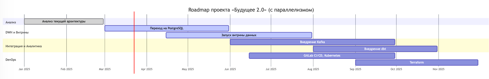

# 1.1. Технический радар

## Технический радар проекта «Будущее 2.0»

| Квадрант                     | Adopt (Использовать)                | Trial (Пробовать)                  | Assess (Оценивать)                                           | Hold (Не использовать)          |
|------------------------------|-------------------------------------|------------------------------------|--------------------------------------------------------------|---------------------------------|
| **Languages & Frameworks**   | Java (Spring Boot) Python (ML, TensorFlow) React, Node.js | Golang                             | Kotlin, Scala                                                | PowerBuilder                    |
| **Datastores & Data Management** | PostgreSQL Hadoop (HDFS) S3 (Data Lake) | ClickHouse                         | Apache Cassandra                                             | SQL Server 2008                 |
| **Infrastructure & Platforms** | Apache Kafka Apache Airflow Kong (API Gateway) | Kubernetes Docker               | Amazon EMR Amazon Redshift                                | Apache Camel (для новых решений) |
| **Tools & Methods**          | Микросервисная архитектура Витрины данных (Data Marts) Self-service аналитика | OpenTelemetry (Observability)      | dbt (data build tool, как пример ETL-системы или на их базе) | Монолитный подход               |

---

## Расшифровка категорий:

- **Adopt (Использовать)** – проверенные технологии, рекомендованные к использованию прямо сейчас.
- **Trial (Пробовать)** – перспективные технологии, которые стоит протестировать в рамках пилотных проектов.
- **Assess (Оценивать)** – технологии, требующие детальной оценки перед потенциальным внедрением.
- **Hold (Не использовать)** – устаревшие или неподходящие технологии, от использования которых необходимо отказаться.

---

## Аргументация выбора технологий:

- **Languages & Frameworks**:
    - **Используемые:** Java и Python обеспечивают надёжность и производительность, React и Node.js дают возможность гибко развивать интерфейсы.
    - **Пробовать:** Golang перспективен для быстрого и производительного финтеха.
    - **Не использовать:** PowerBuilder — устаревшая технология, усложняющая поддержку.

- **Datastores & Data Management**:
    - **Используемые:** PostgreSQL и Hadoop гарантируют гибкость и масштабируемость.
    - **Пробовать:** ClickHouse отлично подходит для аналитики и быстрой работы с данными.
    - **Не использовать:** SQL Server 2008 устарел и не обеспечивает нужную производительность.

- **Infrastructure & Platforms**:
    - **Используемые:** Kafka и Airflow — стандарт де-факто для интеграции и обработки данных. Kong — эффективное решение для управления API.
    - **Пробовать:** Kubernetes и Docker облегчают развёртывание и управление микросервисами.
    - **Не использовать:** Apache Camel в новых решениях не масштабируется так эффективно, как Kafka.

- **Tools & Methods**:
    - **Используемые:** Микросервисная архитектура и витрины данных ускоряют внедрение и облегчают поддержку системы.
    - **Пробовать:** OpenTelemetry улучшает наблюдаемость системы и облегчает мониторинг.
    - **Оценивать:** dbt может значительно улучшить управление обработкой и трансформацией данных.
    - **Не использовать:** Монолитный подход создаёт сложности в поддержке и развитии.

Такой подход позволит компании «Будущее 2.0» эффективно развиваться, избегая использования устаревших решений и своевременно тестируя новые перспективные технологии.

# 1.2. Обоснование изменений

### 1. Модернизация DWH (Переход на PostgreSQL и добавление ClickHouse)

- SQL Server 2008 устарел и ограничивает масштабируемость системы.
- PostgreSQL обеспечивает лучшую производительность, надёжность и отказоустойчивость.
- ClickHouse обеспечивает быстрые аналитические запросы, повышая скорость работы с большими объёмами данных.
- Упрощение интеграции с современными BI-системами и новыми сервисами.

---

### 2. Запуск витрины данных (React + Node.js)

- Упрощает доступ бизнес-пользователей к данным и формированию отчётов.
- React и Node.js обеспечивают создание удобного, быстрого и масштабируемого пользовательского интерфейса.
- Повышается эффективность работы аналитиков и снижается нагрузка на IT-отдел.

---

### 3. Замена интеграционной шины (Kafka вместо Apache Camel)

- Kafka обладает высокой пропускной способностью и надёжностью.
- Возможность реализации асинхронного взаимодействия и стриминговой обработки данных в реальном времени.
- Снижение нагрузки на центральное хранилище данных и улучшение производительности интеграции данных.

---

### 4. Автоматизация DevOps-процессов (GitLab CI/CD, Kubernetes, Terraform)

- GitLab CI/CD ускоряет процесс разработки и выпуска обновлений.
- Kubernetes позволяет легко масштабировать приложения и упрощает управление инфраструктурой.
- Terraform обеспечивает прозрачность, воспроизводимость и управление инфраструктурой как кодом.

---

### 5. Добавление dbt в процесс аналитики

- dbt (Data Build Tool) упрощает управление сложными трансформациями данных.
- Позволяет аналитикам самостоятельно управлять подготовкой и обработкой данных без глубоких технических навыков.
- Ускоряет цикл создания и обновления аналитических витрин.

---

### Итоговые преимущества предложенных изменений:

- **Повышение скорости и производительности системы.**
- **Упрощение процессов разработки и эксплуатации.**
- **Гибкость и масштабируемость для будущего роста компании.**
- **Повышение удовлетворённости пользователей за счёт удобных интерфейсов и оперативной аналитики.**

# 1.3. Roadmap

# Roadmap проекта «Будущее 2.0»

| Этап | Описание изменений                           | Результат                                           | Ответственные команды                      | Требуемые ресурсы            |
|------|----------------------------------------------|-----------------------------------------------------|--------------------------------------------|------------------------------|
| Q1   | Анализ текущей архитектуры                   | Карта проблемных зон и узких мест                  | Архитекторы, DevOps                        | Технический аудит            |
| Q2   | Переход на PostgreSQL, добавление ClickHouse | Повышение производительности, улучшение аналитики  | Бэкенд-разработчики, DBA                   | Серверы, лицензии, инфраструктура |
| Q3   | Запуск витрины данных (React + Node.js)      | Удобный доступ пользователей к данным и аналитике  | Фронтенд-разработчики, Аналитики           | Время на разработку          |
| Q4   | Замена интеграционной шины на Kafka          | Масштабируемая и быстрая интеграция сервисов       | Архитекторы, Разработчики                  | Обучение команды, инфраструктура Kafka |
| Q5   | Внедрение dbt для аналитики                  | Упрощение подготовки данных, улучшение контроля качества данных | Аналитики, Data Engineers                  | Обучение аналитиков, dbt Cloud |
| Q6   | Автоматизация DevOps (GitLab CI/CD, Kubernetes, Terraform) | Ускорение разработки, снижение времени на релизы   | DevOps-инженеры                            | Инструменты CI/CD, Kubernetes-кластер |

---

**Описание этапов:**

- **Q1 (Анализ)**: Понимание текущего состояния и выявление приоритетов.
- **Q2 (Переход на PostgreSQL и ClickHouse)**: Модернизация и оптимизация хранилища данных.
- **Q3 (Запуск витрины данных)**: Повышение удобства и скорости работы с аналитикой.
- **Q4 (Kafka)**: Современная интеграция, масштабируемость и надёжность передачи данных.
- **Q5 (dbt)**: Повышение качества данных и эффективности аналитиков.
- **Q6 (DevOps-автоматизация)**: Сокращение времени вывода изменений в продакшен, улучшение управляемости инфраструктуры.

ниже картинка (с параллелизмом по срокам, для примера):

